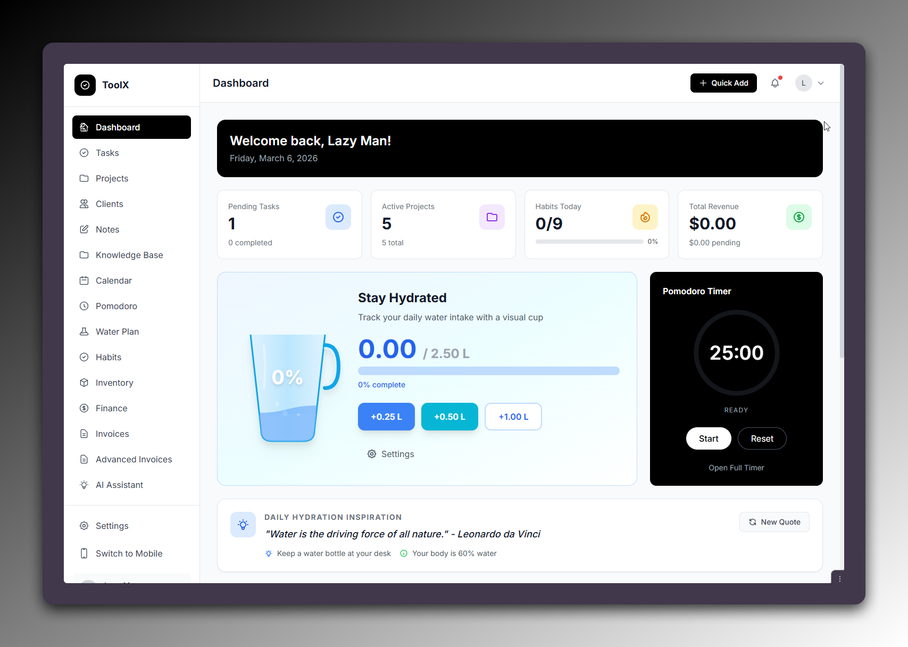

# OpenPlan Work

OpenPlan Work is a PHP task and productivity app with desktop and mobile entry points.

## Requirements

- PHP 8.0 or newer
- `json`, `mbstring`, and `openssl` extensions

## Local Run

- `php start_server.php`
- or use `start_server.bat` on Windows

## Hosted Configuration

Hosted-only auth and image-service switches are environment-controlled.

- [Hosted setup](docs/HOSTED_SETUP.md)
- Example env file: [.env.example](C:\MAMP\htdocs\taskmanager\.env.example)

## Clean Release Export

Maintainers can generate a clean zip for GitHub releases or deployment handoff without shipping live data, secrets, agent folders, or local test/debug artifacts.

- [Export workflow](docs/EXPORT_RELEASE.md)

## Notes

- The export pipeline regenerates an empty `data/` folder in the release artifact.
- `includes/master_password.php` and all live `data/` contents are excluded from the export.
- If you plan to publish this publicly, add a `LICENSE` file before treating it as a true open-source release.
